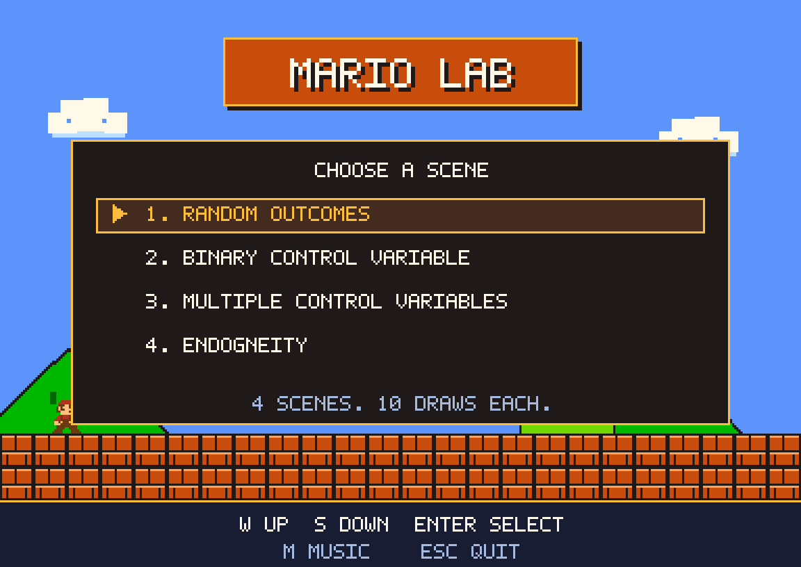
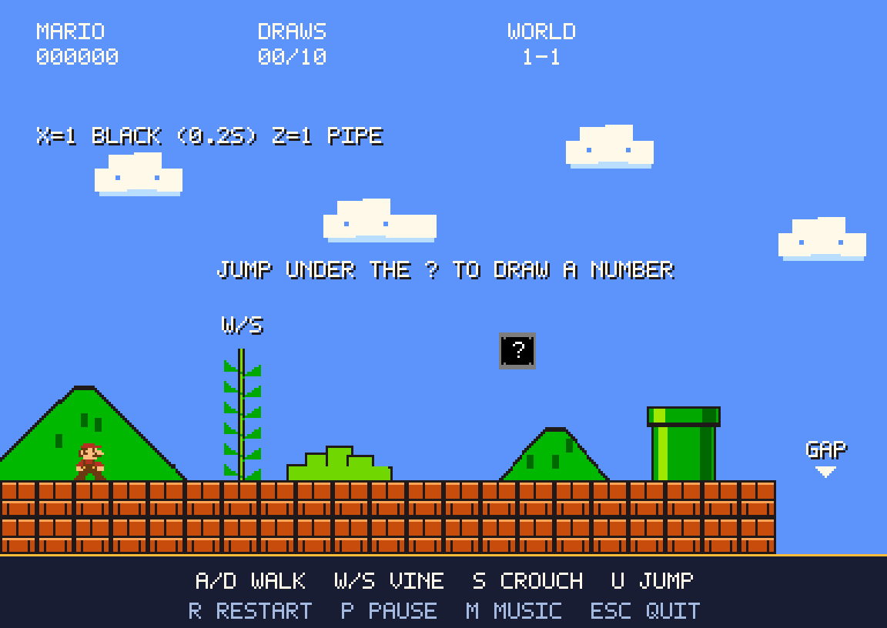

# Mario's World



A small Python/Pygame platformer inspired by the opening of 1985's World 1-1.
The scene and sprites are drawn in code: blue sky, pixel clouds, hills, brick
ground, a green pipe, a little Mario, and a central question block. It uses
original pixel artwork, an original chiptune loop, and synthesized sound effects, with no ROM,
downloaded game assets, or paid software required.



## Start on this Mac

Pygame has already been installed in this project's `.venv`.

```sh
cd /Users/zhshi/Desktop/mario
./play.command
```

You can also double-click **play.command** in Finder. The launcher creates a
virtual environment and installs Pygame on first use if necessary. That first
installation needs internet access. Later runs work offline.

For a smaller window:

```sh
./play.command --scale 2
```

For silent play:

```sh
./play.command --no-sound
```

## Background music

An original chiptune plays on a loop by default. It uses the pulse, triangle,
and noise sounds associated with early console games; it is **not the exact
1985 Super Mario Bros. recording**.

To play your local copy of the exact overworld recording, place a WAV, OGG,
or MP3 in `assets/music/` named `overworld.wav`, `overworld.ogg`, or
`overworld.mp3`. It will be selected automatically on the next launch. Or use:

```sh
./play.command --music "/path/to/your/overworld.mp3"
```

Press **M** to mute/unmute background music while keeping sound effects. Music
pauses with the game, stops on death, and restarts when you press R. To disable
music at launch while keeping sound effects, run `./play.command --no-music`.

## Controls

Click the game window so it receives your keyboard input.

The game opens with a scene menu. Press **W** to move up or **S** to move down,
then **Enter** to select. The choices wrap when you move past either end:

1. **random outcomes** — starts the existing World 1-1 experiment.
2. **binary control variable** — the same experiment, with a black/white block and paired CSV data.
3. **multiple control variables** — the same experiment, with RGB block colors and an outcome based on all three channels.
4. **Endogneity** — one black/white block moves between the vine and pipe, with related X and Z variables.

Music plays in the menu too; M mutes it and Esc closes the game. A CSV is
created only after you select a scene. All four scenes use these controls:

| Key | Action                                                                  |
| --- | ----------------------------------------------------------------------- |
| A   | Walk left                                                               |
| D   | Walk right                                                              |
| W   | Climb up while beside the short vine on the left                        |
| S   | Climb down on the vine; crouch on the ground; descend faster in the air |
| U   | Jump from the ground or jump off the vine                               |
| P   | Pause / continue                                                        |
| M   | Mute / unmute background music                                          |
| R   | Restart with a fresh question block and a new CSV                       |
| Esc | Quit                                                                    |

Gravity is always active away from the vine. Hold A/D to walk. Each jump needs
a new press of U; holding U does not repeatedly jump. Switching to another
window pauses the game. Press P to resume when you return.

## Play the experiment

1. Select **random outcomes** with W/S and Enter. Hold D until Mario is directly underneath the question block in the middle.
   His starting position is about 1.6 seconds of walking from the block.
2. Release D. Press U to hit the block with his head. A coin and a signed
   random number rise out of it, and the draw counter increases.
3. Wait for Mario to land, then press U again. Each successful head hit gives
   one independent pseudorandom sample from **N(0, 1)**: mean 0, standard
   deviation 1. The code uses Python's `random.Random.gauss(0.0, 1.0)`.
4. After ten successful hits, the question block turns brown and loses its
   question mark. More jumps produce no additional draws.
5. Walk right. Use U while approaching the green pipe to jump onto or over it.
   Continue into the gap at the right edge. Mario falls, and **GAME OVER**
   appears. Falling ends the game even if you have collected fewer than ten draws.
6. Press R for a fresh playthrough, or Esc to quit.

The HUD shows the most recent draw and the total saved. Numbers above the box
are rounded to four decimal places for readability; the CSV retains the
full Python float precision. Ten samples will not generally have a sample
mean of exactly zero or a sample standard deviation of exactly one.

## Your CSV files

### Option 4: Endogneity

Select **Endogneity** with W once from the first menu item, or S three times,
then Enter. As in option 2, X controls color: **1 = black, 0 = white**.
Z is drawn uniformly from 0 and 1 on entry and redrawn **after each successful
hit while the box still contains outcomes**. X is drawn on entry and every
**0.2 seconds of active gameplay**, conditional on the current Z:

- **Z = 0:** the single block is on the vine side; P(X = 1) = 0.3.
- **Z = 1:** the single block is on the pipe side; P(X = 1) = 0.7.

The two possible positions are 64 game pixels apart.

The same block moves between these two locations, keeping its hit count.
After a location change, X keeps its current value until the next timed
color draw. A location change does not reset the color timer.
Every successful head hit draws y from the distribution for the X and Z
values **at the moment of the hit**:

| X   | Z   | Outcome distribution |
| --- | --- | -------------------- |
| 1   | 1   | N(2,1)               |
| 0   | 1   | N(1,1)               |
| 1   | 0   | N(1,1)               |
| 0   | 0   | N(-1,1)              |

All four use standard deviation 1. CSV files are saved immediately to
`data/endogeneity_draws_*.csv`, with columns `hit`, `x`, `z`, `y`, and
`timestamp_utc`. Redrawing X/Z or moving the block never adds a row by itself.
The upper-right distribution text is hidden as in options 2 and 3.

After ten hits the block becomes brown and empty, and its location and
variables freeze. Pausing pauses the color timer. R starts option 4 again
with a new CSV. The original pipe, movement controls, and fatal gap remain.

### Option 3: multiple control variables

Select **multiple control variables** with S twice and Enter in the menu.
Three independent integers, **R**, **G**,
and **B**, are drawn uniformly from **0 through 255 inclusive**, immediately
on entry and every **0.2 seconds of active gameplay**. They set the question
block's RGB color. The HUD displays the channels.
Pausing also pauses the color timer.

Each successful head hit uses the channels **at the time of the hit** to
generate **outcome = R + G + B + N(0,1)**. The normal noise is drawn freshly
for each hit, independently of the color draws. Outcomes are not clipped
to the color channel range. Each CSV row contains `hit`, `R`, `G`, `B`,
`outcome`, and `timestamp_utc`, with full float precision. Files are saved
as `data/rgb_draws_*.csv`. Color redraws between hits do not add rows.

After ten hits the box becomes brown and empty and RGB redraws stop. R
restarts option 3 with fresh channels and a new CSV, preserving previous
files. The pipe and fatal gap work as in the other scenes.

### Option 2: binary control variable

Select **binary control variable** with S and Enter in the starting menu.
The scene plays like option 1. A binary variable is drawn immediately on entry
and redrawn every **0.2 seconds of active gameplay**, with equal probability
of 0 or 1. **0 makes the question block white; 1 makes it black.** Repeated
draws can give the same value, so its color need not change at every interval.
Pausing also pauses the binary timer.

Each successful head hit saves the binary value **at the time of the hit**
and its conditional normal outcome in the same CSV row: **N(0,1)** for
**0 (white)**, or **N(1,1)** for **1 (black)**. Both distributions have
standard deviation 1. Color redraws
between hits do not create rows. The CSV has columns `hit`, `binary_variable`,
`outcome`, and `timestamp_utc`; the filename starts with `binary_draws_`.

After ten hits the box becomes brown and empty, and binary redraws stop.
Restarting with R keeps you in option 2 with a fresh box, binary draw, and CSV.
The right-hand gap still ends the game.

### Option 1: random outcomes

Each playthrough creates its own file in **data/** beside the game:

```text
data/draws_20261007T070000_123456Z.csv
```

The filename uses UTC date/time. Columns are `hit`, `value`, and
`timestamp_utc`. The first draw is hit 1; the tenth is hit 10. Each row is
flushed to disk immediately, so closing the window or falling into the gap
keeps your recorded draws. Restarting preserves previous files. An attempt
with no hits leaves a file containing only the column header.

Open a CSV in Excel, Numbers, a text editor, or Python. To put files elsewhere:

```sh
./play.command --data-dir ~/Desktop/mario-draws
```

## Test it

Automated checks cover ten real jumps and head collisions, the empty block,
normal sampling, CSV precision and persistence, vine movement, crouching,
pipe collisions, falling into the gap, and handling a failed save. They use
temporary directories and never change your real game data.

```sh
cd /Users/zhshi/Desktop/mario
.venv/bin/python -m unittest -v test_game
```

To also exercise the complete Pygame loop, rendering, sounds, simulated
keyboard input, death, and restart without opening a window:

```sh
.venv/bin/python -m unittest -v test_headless
```

To render a preview without opening a game window or creating a playthrough:

```sh
.venv/bin/python game.py --screenshot preview.png
```

To preview the initial menu:

```sh
.venv/bin/python game.py --screenshot menu-preview.png --screenshot-scene menu
```

To preview option 2:

```sh
.venv/bin/python game.py --screenshot binary-preview.png --screenshot-scene binary
```

To preview option 3:

```sh
.venv/bin/python game.py --screenshot rgb-preview.png --screenshot-scene rgb
```

To preview option 4:

```sh
.venv/bin/python game.py --screenshot endogeneity-preview.png --screenshot-scene endogeneity
```

For a manual check, follow the six play steps above. After ten hits, open that
playthrough's CSV and confirm it has one header plus ten data rows. Jump again
and confirm no extra row is added. Fall into the gap, restart, and confirm the
old file remains alongside a new one.

## Other computers

Install Python 3.9 or newer and run these commands in the project directory:

```sh
python3 -m venv .venv
source .venv/bin/activate
python -m pip install -r requirements.txt
python game.py
```

On Windows, use `py -m venv .venv`, then `.venv\Scripts\activate` instead of
the first two commands. Pygame is the only dependency.

## Files

- `game.py`: pixel artwork, window, keyboard controls, sounds, and game loop.
- `game_logic.py`: movement, collisions, normal draws, and CSV storage.
- `music.py`: original music synthesis and looping audio playback.
- `assets/music/`: the included tune and optional local overworld recording.
- `test_game.py`: automated logic checks.
- `test_headless.py`: automated Pygame loop and drawing checks.
- `play.command`: macOS launcher.
- `preview.png`: rendered scene preview.
- `menu-preview.png`: rendered starting menu.
